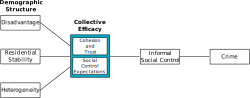

```{r setup, include=FALSE}
library(tidyverse)

knitr::opts_chunk$set(echo = TRUE, dev = "ragg_png")
nuff_col <- c("Nuffield Teal"  = "#00a191",
  "Nuffield Black" = "#212221",
  "Pure White"     = "#ffffff",
  "Cobalt Blue"    = "#002f87",
  "Rose Red"       = "#e9004c",
  "Electric Blue"  = "#00acc8",
  "Peach Orange"   = "#ffc7be",
  "Pine Green"     = "#00665e",
  "Burgundy"       = "#692044",
  "Sky Blue"       = "#c0dfeb",
  "Celadon Green"  = "#dce0ca")
```


# The Growth of Airbnb


.image-90[

]

.footnote[Source: [Sherwood (2019) *The Guardian*](https://www.theguardian.com/technology/2019/may/05/airbnb-homelessness-renting-housing-accommodation-social-policy-cities-travel-leisure)]

???

Airbnb has grown explosively since its founding in 2008. I expect some or most of you have either stayed in or operated one, and everyone is at least aware of Airbnb as an alternative to conventional hotels.

News and social media are filled with concerns that this growth of short-term rentals is now having harmful impacts on communities throughout the world.

---
# Housing Markets

Barron et al. (2020, p. 45):

> To summarize the state of the literature on home-sharing, research (including this paper) has found that **home-sharing (1) raises local rental rates** by causing a reallocation of the housing stock, (2) **raises house prices** through both the capitalization of rents and the increased ability to use excess capacity...

???

The most well-recognized effects are on housing markets, with many studies finding short-term renting reduces the housing supply and drives prices up for both renters and buyers.

This occurs because property owners find it more profitable to operate an Airbnb than offer conventional rentals, and this profitability has lead some Airbnb operators to purchase additional homes---sometimes dozens---to operate full-time Airbnbs.

---
# Anti-Social Behaviour

.image-90[

]
.footnote[Source: [Lazzaro (2017) *The Observer*](https://observer.com/2017/03/airbnb-nda-damage-in-london-after-drug-party/)]


???

Short-term rentals may also contribute to disorder and anti-social behaviour. 

While Airbnb claims these incidents are exceedingly rare, news media abounds with stories---like the one pictured---of nightmare Airbnb guests destroying apartments and parties getting out of hand. We've heard some concerns from police about this as well.


---
# Destabilization

.image-90[

]

.footnote[Source: [Kommenda et al. (2020) *The Guardian*](https://www.theguardian.com/technology/2020/feb/20/revealed-the-areas-in-the-uk-with-one-airbnb-for-every-four-homes)]

???

In some markets, like London, Airbnb growth has become extreme: there are neighborhoods where a quarter or more of housing units are dedicated Airbnb properties

We actually estimate as high as 60% in one LSOA in Soho in one quarter.

There are concerns that this concentration is destabilizing communities and changing their character as residents are increasingly transient and anonymous

---
class: inverse
background-image: linear-gradient(to right, rgba(0, 0, 0, .6), rgba(0, 0, 0, .6)), url("img/london_street.jpg")
background-size: cover

# Criminological Theory

## and Airbnb

???

Based on all that, criminological theory gives us reasons to expect that the proliferation of Airbnbs will increase crime rates

We focus on two theories in this paper

---
# Routine Activities Theory


* A crime is the result of a criminal .bam[opportunity]

* Anything that creates opportunities will increase crime rates

  * This occurs *rapidly*

???

The first is routine activities theory.

Routine activities theory describes crime as the result of opportunities: convergences of likely offenders and suitable targets in the absence of capable guardians.

When the number of opportunities increases, crime increases immediately.

Airbnb properties may contribute to opportunities in a number of ways

---
# Airbnb and Routine Activity

* Guests as *likely offenders*

   * More prone to anti-social behaviour

--

* Guests as *suitable targets*

   * Often away from residence (e.g., assault, robbery)
   * Less aware of and averse to risky situations
   * Recognizable as high-value targets
--

* Guests as *incapable guardians*

   * Less attached to neighborhood
   * Unfamiliar with residents and local norms
   * Often away from residence (e.g., burglary)

--

.centernote[These should be stronger for *entire properties* than *spare rooms*.]

---
# Social Disorganization





* Strong neighborhood institutions reduce crime by promoting .bam[social control]

* Destabilizing social structures increases crime by reducing social control

   * This usually occurs *slowly*


???

The second theory is social disorganization.

Social disorganization is a macro-theory of social control that says that sociodemographic advantage and stability promote social control capacity---often operationalized using collective efficacy as we do in the paper

Social control capacity influences criminal opportunity---mainly through guardianship---and tends to be fairly stable over time

Based on social disorganization, we expect Airbnb to increase crime mainly by inducing residential instability

---
## Airbnb and Social Disorganization


Entire properties *replace* longer-term residents with very short-term ones

* Reduces attachment to neighbourhood
* Inhibits social network formation
* Weakens institutions

--

Spare rooms only *add* short-term residents

* Less disruptive
* May promote stability with additional income

---
# Causal Model

We encode these theories into a causal model

.image-280[
```{tikz theory-dag, echo = FALSE, cache = TRUE, dev = "svg"}
\usetikzlibrary{positioning}
\definecolor{black}{HTML}{000000}
\tikzset{
    > = stealth,
    every node/.append style = {
        draw = none
    },
    every path/.append style = {
        arrows = ->,
        draw = black,
        fill = none
    },
    hidden/.style = {
        draw = black,
        shape = circle,
        inner sep = 1pt
    }
}
\tikz{
    \node (a1) at (0,0) {$A_1$};
    \node[hidden] (u) at (1,-1) {$U$};
    \node (c1) at (0,2)  {$C_1$};
    \node (a2) at (2,0)  {$A_2$};
    \node (c2) at (2,2)  {$C_2$};
    \node[hidden] (o1) at (0,1)  {$O_1$};
    \node[hidden] (o2) at (2,1)  {$O_2$};
    \node[hidden] (s1) at (-1,1) {$S_1$};
    \node[hidden] (s2) at (1,1)  {$S_2$};
    \path (a1) edge (o1);
    \path (c1) edge (o2);
    \path (c1) edge (s2);
    \path (o1) edge (c1);
    \path (a2) edge (o2);
    \path (o2) edge (c2);
    \path (a1) edge (a2);
    \path (a1) edge (s2);
    \path (a1) edge (s2);
    \path (s2) edge (o2);
    \path (s1) edge (o1);
    \path (c1) edge [bend right=25] (a2);
    \path (u) edge (a1);
    \path (u) edge (a2);
    \path (u) edge [bend left=45] (s1);
    \path (u) edge (s2);
    \path (u) edge (o1);
    \path (u) edge (o2);
    \path (u) edge [bend left=60] (c1);
    \path (u) edge [bend right=60] (c2);
  }
```
]

.pull-left[
* **A**irbnbs
* **C**rime
]
.pull-right[
* **O**pportunity
* **S**ocial control capacity
* **U**nobservables (time stable)
]

---
# Hypotheses

1. **Airbnb properties are positively related to crime**

2. **Entire properties will be more strongly related to crime than rooms**

3. Airbnb activity will be negatively related to collective efficacy

4. The association between Airbnb activity and crime is partly explained by collective efficacy

.centernote[*I will focus on 1 and 2 today*]


---
class: inverse
background-image: linear-gradient(to right, rgba(0, 0, 0, .6), rgba(0, 0, 0, .6)), url("img/london.jpg")
background-size: cover

# Airbnb and London

---
# Airbnb and London

* One of the most popular Airbnb markets

  * \> 100,000 listings in a year<sup>1</sup>
  * 20% of surveyed households hosted in past year<sup>2</sup>
  * \>= 10% of dwellings are Airbnbs in some districts<sup>3</sup>

.footnote[
[1] Temperton 2020; [2] MHCLH 2019; [3] Kommenda et al., 2020
]

--

* Recent policies promote Airbnb usage

  * Deregulation Act 2015

      * Permits 90 days of main residence renting per year

  * 2016 "Rent a Room" tax allowance

      * Increased from £4,250 to £7,500 

---
# Data

.pull-left[
.bam[Active Airbnb properties] from *AirDNA* via CDRC

* Nov 2014 - May 2018
* Property-month observations
* Property type
* Geolocation
   
]
.pull-right[


]


---
count: false

# Data

.pull-left[
.bam[Active Airbnb properties] from *AirDNA* via CDRC

* Nov 2014 - May 2018
* Property-month observations
* Property type
* Geolocation
   

Police-recorded .bam[crime] from *data.london.gov.uk* and *data.police.uk*

* 6 crime types
* Mix of LSOA counts and approximate geolocation


]


---
count: false

# Data

.pull-left[
.bam[Active Airbnb properties] from *AirDNA* via CDRC

* Nov 2014 - May 2018
* Property-month observations
* Property type
* Geolocation
   

Police-recorded .bam[crime] from *data.london.gov.uk* and *data.police.uk*

* 6 crime types
* Mix of LSOA counts and approximate geolocation

]

.pull-right[

<br>Public Attitudes Survey (PAS)

* .bam[Collective efficacy]

]

---
count: false

# Data

.pull-left[
.bam[Active Airbnb properties] from *AirDNA* via CDRC

* Nov 2014 - May 2018
* Property-month observations
* Property type
* Geolocation
   

Police-recorded .bam[crime] from *data.london.gov.uk* and *data.police.uk*

* 6 crime types
* Mix of LSOA counts and approximate geolocation


]
.pull-right[

<br>Public Attitudes Survey (PAS)

* .bam[Collective efficacy]

Not shown today:

* PAS:
   * Perceived crime
   * Perceived police patrols
* Airbnb usage
* Policy instruments
* Premier League games
* Property prices
* Police stops
]


---


.footnote[Average 39,000 active per month with 4.5 million estimated guests across study period]

---


---
class: inverse
background-image: linear-gradient(to right, rgba(0, 0, 0, .6), rgba(0, 0, 0, .6)), url("img/house_party.jpg")
background-size: cover

# Airbnb and Crime

---
# The Model Again

.image-280[
```{tikz theory-dag-2, echo = FALSE, cache = TRUE, dev = "svg"}
\usetikzlibrary{positioning}
\definecolor{black}{HTML}{000000}
\tikzset{
    > = stealth,
    every node/.append style = {
        draw = none
    },
    every path/.append style = {
        arrows = ->,
        draw = black,
        fill = none
    },
    hidden/.style = {
        draw = black,
        shape = circle,
        inner sep = 1pt
    }
}
\tikz{
    \node (a1) at (0,0) {$A_1$};
    \node[hidden] (u) at (1,-1) {$U$};
    \node (c1) at (0,2)  {$C_1$};
    \node (a2) at (2,0)  {$A_2$};
    \node (c2) at (2,2)  {$C_2$};
    \node[hidden] (o1) at (0,1)  {$O_1$};
    \node[hidden] (o2) at (2,1)  {$O_2$};
    \node[hidden] (s1) at (-1,1) {$S_1$};
    \node[hidden] (s2) at (1,1)  {$S_2$};
    \path (a1) edge (o1);
    \path (c1) edge (o2);
    \path (c1) edge (s2);
    \path (o1) edge (c1);
    \path (a2) edge (o2);
    \path (o2) edge (c2);
    \path (a1) edge (a2);
    \path (a1) edge (s2);
    \path (a1) edge (s2);
    \path (s2) edge (o2);
    \path (s1) edge (o1);
    \path (c1) edge [bend right=25] (a2);
    \path (u) edge (a1);
    \path (u) edge (a2);
    \path (u) edge [bend left=45] (s1);
    \path (u) edge (s2);
    \path (u) edge (o1);
    \path (u) edge (o2);
    \path (u) edge [bend left=60] (c1);
    \path (u) edge [bend right=60] (c2);
  }
```
]

.pull-left[
* **A**irbnbs
* **C**rime
]
.pull-right[
* **O**pportunity
* **S**ocial control capacity
* **U**nobservables
]

.centernote[*If concerned only with A → C, we can ignore mediators*]


???

Here's the model again.

For the main analysis, we're only interested in total effects of Airbnb on crime, so we can ignore the mediators to get a simpler model.


---
# Simplified Model

.image-280[
```{tikz model-dag, echo = FALSE, cache = TRUE, dev = "svg"}
\usetikzlibrary{positioning}
\definecolor{black}{HTML}{000000}
\tikzset{
    > = stealth,
    every node/.append style = {
        draw = none
    },
    every path/.append style = {
        arrows = ->,
        draw = black,
        fill = none
    },
    hidden/.style = {
        draw = black,
        shape = circle,
        inner sep = 1pt
    }
}
\tikz{
    \node (a1) at (0,0) {$A_1$};
    \node[hidden] (u) at (1,-1) {$U$};
    \node (c1) at (0,2)  {$C_1$};
    \node (a2) at (2,0)  {$A_2$};
    \node (c2) at (2,2)  {$C_2$};
    \path (a1) edge (c1);
    \path (c1) edge (c2);
    \path (a2) edge (c2);
    \path (a1) edge (a2);
    \path (a1) edge (c2);
    \path (c1) edge (a2);
    \path (u) edge (a1);
    \path (u) edge (a2);
    \path (u) edge [bend left=60] (c1);
    \path (u) edge [bend right=60] (c2);
  }
```
]

.pull-left[
* **A**irbnbs
* **C**rime
]
.pull-right[
* ~~**O**pportunity~~
* ~~**S**ocial control capacity~~
* **U**nobservables
]

.centernote[*This is a cross-lagged panel model*]

---
# Method: ML-SEM

Maximum Likelihood Fixed Effects Cross-Lagged Panel Model (ML-SEM)<sup>1</sup>

* Asymptotically equivalent to Arellano-Bond<sup>2</sup>

  * Contemporaneous and lagged effects
  * Autoregressive parameter
  * Predetermined regressors
  * Addresses time-stable confounders

* Practical differences

  * Better finite sample performance
  * Infeasible with large $T$
  * Gaussian errors
  * Gets angry about heavy skew

* $N$ = 4835 LSOAs, $T$ = 13 quarters

.pull-right30[
.footnote[
[1] Allison et al. (2017)<br>
[2] Arellano & Bond (1991)
]
]

---

.image-tall[

]

---
# Property Types

Both theories suggest effects should be concentrated in *entire homes and apartments*

???

Our next hypothesis was that criminogenic effects should be more prominent for entire properties, because they reduce guardianship, increase suitability, and destabilize communities more than spare rooms

--

Respecify model with disaggregated Airbnb measures:

* Entire Homes and Apartments

* Private Rooms

* Shared Rooms

---

.image-tall[

]

???


Here is the same type of plot again, but now I show only contemporaneous effects because the lagged ones are all near-zero again.

As expected, we see the total association is mainly driven by entire properties---though we see a bit of evidence for private rooms and burglary.

This provides support for our second hypothesis.

---
# Summary


Per quarter, each additional Airbnb is associated with...

* 0.03 robberies
* 0.04 burglaries
* 0.16 thefts
* 0.06 violent offenses


???

Okay, let's talk about these results a bit.

We find, per quarter...

... these may seem small in magnitude, but keep in mind many LSOAs have dozens or even upwards of a hundred dedicated Airbnb properties.


We also find these estimates are quite stable (or robust) across different specifications, including different causal timings, Premier league games, spatial clustering, and even excluding Zone 1 of London


--

Effects driven by entire homes and apartments for rent

--

Effects appear operate in short-term

* Suggests opportunity as mechanism

--

.centernote[
*But we can also test collective efficacy as a mechanism*
]


---
count: false
class: inverse
background-image: linear-gradient(to right, rgba(0, 0, 0, .5), rgba(0, 0, 0, .5)), url("img/onion_airbnb.jpg"), linear-gradient(to right, rgba(0, 0, 0, 1), rgba(0, 0, 0, 1))
background-size: 100%, 50%, 100%
background-position: center, center, center

# Airbnb and Collective Efficacy

---
count: false
# Yet Again

.image-280[
```{tikz theory-dag-3, echo = FALSE,  cache = TRUE, dev = "svg"}
\usetikzlibrary{positioning}
\definecolor{black}{HTML}{000000}
\tikzset{
    > = stealth,
    every node/.append style = {
        draw = none
    },
    every path/.append style = {
        arrows = ->,
        draw = black,
        fill = none
    },
    hidden/.style = {
        draw = black,
        shape = circle,
        inner sep = 1pt
    }
}
\tikz{
    \node (a1) at (0,0) {$A_1$};
    \node[hidden] (u) at (1,-1) {$U$};
    \node (c1) at (0,2)  {$C_1$};
    \node (a2) at (2,0)  {$A_2$};
    \node (c2) at (2,2)  {$C_2$};
    \node[hidden] (o1) at (0,1)  {$O_1$};
    \node[hidden] (o2) at (2,1)  {$O_2$};
    \node[hidden] (s1) at (-1,1) {$S_1$};
    \node[hidden] (s2) at (1,1)  {$S_2$};
    \path (a1) edge (o1);
    \path (c1) edge (o2);
    \path (c1) edge (s2);
    \path (o1) edge (c1);
    \path (a2) edge (o2);
    \path (o2) edge (c2);
    \path (a1) edge (a2);
    \path (a1) edge (s2);
    \path (a1) edge (s2);
    \path (s2) edge (o2);
    \path (s1) edge (o1);
    \path (c1) edge [bend right=25] (a2);
    \path (u) edge (a1);
    \path (u) edge (a2);
    \path (u) edge [bend left=45] (s1);
    \path (u) edge (s2);
    \path (u) edge (o1);
    \path (u) edge (o2);
    \path (u) edge [bend left=60] (c1);
    \path (u) edge [bend right=60] (c2);
  }
```
]

.pull-left[
* **A**irbnbs
* **C**rime
]
.pull-right[
* **O**pportunity
* **S**ocial control capacity
* **U**nobservables
]

--

.centernote[*This time we care about S*]

---
count: false
# Simplified Again

.image-280[
```{tikz ce-dag, echo = FALSE,  cache = TRUE, dev = "svg"}
\usetikzlibrary{positioning}
\definecolor{black}{HTML}{000000}
\tikzset{
    > = stealth,
    every node/.append style = {
        draw = none
    },
    every path/.append style = {
        arrows = ->,
        draw = black,
        fill = none
    },
    hidden/.style = {
        draw = black,
        shape = circle,
        inner sep = 1pt
    }
}
\tikz{
    \node (a1) at (0,0) {$A_1$};
    \node[hidden] (u) at (1,-1) {$U$};
    \node (c1) at (0,2)  {$C_1$};
    \node (a2) at (2,0)  {$A_2$};
    \node (c2) at (2,2)  {$C_2$};
    \node[hidden] (s1) at (-1,1) {$S_1$};
    \node[hidden] (s2) at (1,1)  {$S_2$};
    \path (a1) edge (c1);
    \path (c1) edge (c2);
    \path (c1) edge (s2);
    \path (a2) edge (c2);
    \path (a1) edge (a2);
    \path (a1) edge (s2);
    \path (a1) edge (s2);
    \path (s2) edge (c2);
    \path (s1) edge (c1);
    \path (c1) edge [bend right=25] (a2);
    \path (u) edge (a1);
    \path (u) edge (a2);
    \path (u) edge [bend left=45] (s1);
    \path (u) edge (s2);
    \path (u) edge [bend left=60] (c1);
    \path (u) edge [bend right=60] (c2);
  }
```
]

.pull-left[
* **A**irbnbs
* **C**rime
]
.pull-right[
* ~~**O**pportunity~~
* **S**ocial control capacity
* **U**nobservables
]


---
count:false
# Measuring Collective Efficacy

Collective efficacy is a community-level .bam[latent variable]

* Survey respondents act as *informants*

--

Assume informant responses to collective efficacy indicators are a mix of:

* Latent variable we want to measure
* Non-systematic (random) measurement error
* Systematic perceptual error of individuals

--

Validity of measurement rests on .bam[reliability], a function of:

* Agreement between informants
* **Number of informants in each neighborhood**

--

.centernote[*We need to remove measurement error and estimate reliability*]


---
count: false
## Multilevel Measurement Model

.image-75[

]

---
count: false
## Stage 1

.image-75[

]

.centernote[*Purge measurement error, obtain individual estimate*]

---
count: false
## Stage 2

.image-75[

]

.centernote[*Adjust for composition, obtain neighborhood estimate*]

---
count: false
# Specification

.footnote[[1] All covariances hidden for legibility]

.pull-left60[
.image-100[
```{tikz sem-dag-2, echo = FALSE,  cache = TRUE, dev = "svg"}
\usetikzlibrary{positioning,arrows.meta}
\definecolor{black}{HTML}{000000}
\definecolor{rose}{HTML}{e9004c}
\definecolor{cobalt}{HTML}{002f87}
\definecolor{pine}{HTML}{00665e}
\definecolor{electric}{HTML}{00acc8}
\definecolor{burgundy}{HTML}{692044}
\tikzset{
    every node/.append style = {
        draw = none
    },
    hidden/.style = {
        draw = black,
        shape = circle,
        inner sep = 1pt
    }
}
\tikz{
  \node (a1) at (1.2,0) {$A_1$};
  \node (a2) at (2.2,0) {$A_2$};
  \node (a3) at (3.2,0) {$A_3$};
  \node (a4) at (4.2,0) {$A_4$};
  \node (s1) at (0.80,0) {$S_1$};
  \node (s2) at (1.80,0) {$S_2$};
  \node (s3) at (2.80,0) {$S_3$};
  \node (s4) at (3.80,0) {$S_4$};
  \node (c1) at (1,2) {$C_1$};
  \node (c2) at (2,2) {$C_2$};
  \node (c3) at (3,2) {$C_3$};
  \node (c4) at (4,2) {$C_4$};
  \node[hidden] (u) at (0.5,1) {$U$};
  \path[-stealth, burgundy] (c1) edge (c2);
  \path[-stealth, burgundy] (c2) edge (c3);
  \path[-stealth, burgundy] (c3) edge (c4);
  \path[-stealth, pine] (u) edge (c2);
  \path[-stealth, pine] (u) edge (c3);
  \path[-stealth, pine] (u) edge (c4);
  \path[-stealth, rose] (a1) edge [thick] (c2);
  \path[-stealth, electric] (a2) edge [thick] (c2);
  \path[-stealth, rose] (a2) edge [thick] (c3);
  \path[-stealth, electric] (a3) edge [thick] (c3);
  \path[-stealth, rose] (a3) edge [thick] (c4);
  \path[-stealth, electric] (a4) edge [thick] (c4);
  \path[-stealth, rose] (s1) edge [thick] (c2);
  \path[-stealth, electric] (s2) edge [thick] (c2);
  \path[-stealth, rose] (s2) edge [thick] (c3);
  \path[-stealth, electric] (s3) edge [thick] (c3);
  \path[-stealth, rose] (s3) edge [thick] (c4);
  \path[-stealth, electric] (s4) edge [thick] (c4);
  }
```

]
]

.pull-right30[

Outcome (Ct):
* **Logged** Ward-year crime counts

Features:

* Airbnb and CE:
  * .electric[Contemporaneous]
  * .rose[Lagged]
* .pine[Fixed effects]
* .burgundy[Autoregression]
* Predetermined regressors<sup>1</sup>
]

---
count: false

# Units of Analysis

Given our models, how should we aggregate data?

--

&zwj;Space:

* Some theoretical debate over spatial scale of social control
* Many respondents needed for reliable measurement

--

&zwj;Time:

* Social control effects are slow
* Changes in social control capacity may be even slower
* Many respondents needed for reliable measurement

--

&zwj;Unit: **Ward-years**

* High CE reliability: 0.71
* Few zeroes but high skew in crime


---
count: false

.image-90[

]


---
count: false
# Airbnb and Collective Efficacy

How is Airbnb activity related to collective efficacy?

* Estimate both sides of Airbnb and CE cross-lagged model

--

.image-90[

]

---

# Summary

Weak collective efficacy effects

   * Inconsistent with social disorganization

--

Weaker but persistent Airbnb effects

   * Inconsistent with social disorganization
   * More consistent with routine activity
      * Opportunity is contemporaneous and local

--

Airbnb activity may reduce collective efficacy over time


---
class: inverse
background-image: linear-gradient(to right, rgba(0, 0, 0, .6), rgba(0, 0, 0, .6)), url("img/oxford_houses.jpg")
background-size: cover

# Discussion


---
# Implications

Private short-term letting is reshaping the urban landscape

* Increasing apartment rents and home prices
* .bam[Compromising public safety]

???

Let's talk about implications.

--

Short-term letting is highly commercialized

* Primarily dedicated year-round properties
* Dominated by hosts with multiple dedicated properties

--

This is an externality problem

* Benefits accrue to few property owners
* Livability and affordability reduced for all

???

In economic terms, this is an externality problem

--

.centernote[*Policy is needed to address the social costs of short-term letting, in particular from dedicated properties*]


---
class: inverse
# Q&A

# *Thank you!*

---
count:false
class: inverse
# Appendix

---
count:false
# ML-SEM Specification


.pull-left60[
.image-100[
```{tikz sem-dag, echo = FALSE, cache = TRUE, dev = "svg"}
\usetikzlibrary{positioning,arrows.meta}
\definecolor{black}{HTML}{000000}
\definecolor{rose}{HTML}{e9004c}
\definecolor{cobalt}{HTML}{002f87}
\definecolor{pine}{HTML}{00665e}
\definecolor{electric}{HTML}{00acc8}
\definecolor{burgundy}{HTML}{692044}
\tikzset{
    every node/.append style = {
        draw = none
    },
    hidden/.style = {
        draw = black,
        shape = circle,
        inner sep = 1pt
    }
}
\tikz{
  \node (a1) at (1,0) {$A_1$};
  \node (a2) at (2,0) {$A_2$};
  \node (a3) at (3,0) {$A_3$};
  \node (a4) at (4,0) {$A_4$};
  \node (c1) at (1,2) {$C_1$};
  \node (c2) at (2,2) {$C_2$};
  \node (c3) at (3,2) {$C_3$};
  \node (c4) at (4,2) {$C_4$};
  \node (e2) at (2,3) {$e_2$};
  \node (e3) at (3,3) {$e_3$};
  \node (e4) at (4,3) {$e_4$};
  \node[hidden] (u) at (0,0) {$U$};
    
    \path[stealth-stealth] (u) edge [bend left=30] (c1);
    \path[stealth-stealth] (u) edge [bend right=30] (a1);
    \path[stealth-stealth] (u) edge [bend right=30] (a2);
    \path[stealth-stealth] (u) edge [bend right=30] (a3);
    \path[stealth-stealth] (u) edge [bend right=30] (a4);
    \path[stealth-stealth] (c1) edge [bend right=20] (a1);
    \path[stealth-stealth] (c1) edge [bend right=20] (a2);
    \path[stealth-stealth] (c1) edge [bend right=20] (a3);
    \path[stealth-stealth] (c1) edge [bend right=20] (a4);
    \path[stealth-stealth] (a1) edge [bend right=30] (a2);
    \path[stealth-stealth] (a1) edge [bend right=30] (a3);
    \path[stealth-stealth] (a1) edge [bend right=30] (a4);
    \path[stealth-stealth] (a2) edge [bend right=30] (a3);
    \path[stealth-stealth] (a2) edge [bend right=30] (a4);
    \path[stealth-stealth] (a3) edge [bend right=30] (a4);
    \path[stealth-stealth, cobalt] (e2) edge [bend left=20] (a3);
    \path[stealth-stealth, cobalt] (e2) edge [bend left=30] (a4);
    \path[stealth-stealth, cobalt] (e3) edge [bend left=20] (a4);

    \path[-stealth, burgundy] (c1) edge (c2);
    \path[-stealth, burgundy] (c2) edge (c3);
    \path[-stealth, burgundy] (c3) edge (c4);
    \path[-stealth, pine] (u) edge (c2);
    \path[-stealth, pine] (u) edge (c3);
    \path[-stealth, pine] (u) edge (c4);
    \path[-stealth] (e2) edge (c2);
    \path[-stealth] (e3) edge (c3);
    \path[-stealth] (e4) edge (c4);
    \path[-stealth, rose] (a1) edge [thick] (c2);
    \path[-stealth, electric] (a2) edge [thick] (c2);
    \path[-stealth, rose] (a2) edge [thick] (c3);
    \path[-stealth, electric] (a3) edge [thick] (c3);
    \path[-stealth, rose] (a3) edge [thick] (c4);
    \path[-stealth, electric] (a4) edge [thick] (c4);
  }
```
]
]

.pull-right30[

Outcome (Ct):
* LSOA-quarter crime counts

&zwj;Features:

* Airbnb effects:
  * .electric[Contemporaneous]
  * .rose[Lagged]
* .pine[Fixed effects]
* .burgundy[Autoregression]
* .cobalt[Predetermined regressors]
]


---
count:false
# References

.small[
Allison, P. D., Williams, R., & Moral-Benito, E. (2017). Maximum Likelihood for Cross-lagged Panel Models with Fixed Effects. Socius: Sociological Research for a Dynamic World, 3, 237802311771057. https://doi.org/10.1177/2378023117710578<br>
Arellano, M., & Bond, S. (1991). Some Tests of Specification for Panel Data: Monte Carlo Evidence and an Application to Employment Equations. The Review of Economic Studies, 58(2), 277. https://doi.org/10.2307/2297968<br>
Barron, K., Kung, E., & Proserpio, D. (2021). The Effect of Home-Sharing on House Prices and Rents: Evidence from Airbnb. Marketing Science, 40(1), 23–47. https://doi.org/10.1287/mksc.2020.1227<br>
Kommenda, N., Pidd, H., & Brooks, L. (2020). Revealed: The areas in the UK with one Airbnb for every four homes. The Guardian.<br>
Ministry of Housing, Communities & Local Government (MHCLG). (2019). English housing survey: Private rented sector, 2017-2018. Ministry of Housing, Communities & Local Government.<br>
Temperton, J. (2020). Airbnb has devoured London - and here’s the data that proves it. Wired UK.

Unsplash photos:

[Title slide photo by Andrea Davis](https://unsplash.com/photos/NngNVT74o6s)<br>
[House party photo by Jacob Bentzinger](https://unsplash.com/photos/_HXFz-0g9w8)<br>
[Oxford houses by Toa Heftiba](https://unsplash.com/photos/nrSzRUWqmoI)<br>
[London street by Tomek Baginski](https://unsplash.com/photos/SiGPM-HLYyk)<br>
[London aerial photo by Benjamin Davies](https://unsplash.com/photos/Oja2ty_9ZLM)

[Story from the Onion](https://www.theonion.com/whole-conversation-wasted-getting-to-know-new-neighbors-1849022517)


]